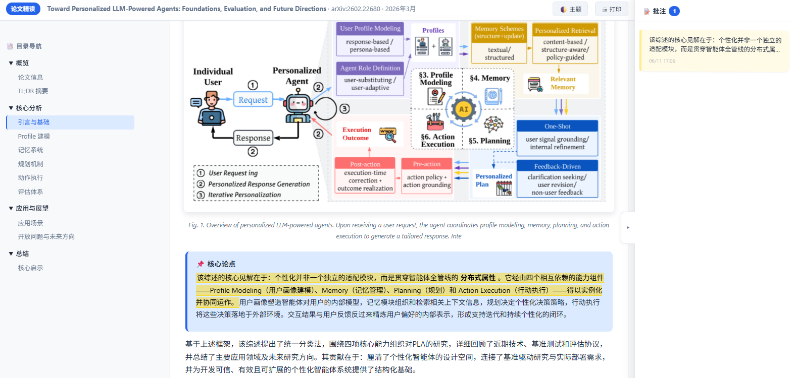

# Paper to HTML Reading Note

> **⚠️ Token cost**: Generating a full reading note consumes approximately **60k–120k tokens** (varies by paper length, pipeline mode, and organization strategy). Use judiciously and plan your budget accordingly.

Convert academic CS/SE PDF papers into **self-contained, interactive HTML reading notes** — dark mode, sidebar navigation, rich component library, with **4 organization strategies** matched to your reading intent. Annotation language is chosen by the user (Simplified Chinese or English).

**One HTML file, zero external dependencies.** KaTeX loads from CDN on first visit, falls back to monospace when offline.


---

## Features

- 🌓 **Dark/Light mode** — persisted to `localStorage` across sessions
- 📑 **Sticky sidebar** — IntersectionObserver highlights active section, collapsible groups
- 🔗 **h2 anchor links** — hover reveals `#` link, click triggers section-flash animation
- 📊 **Reading progress bar** — accent→cyan gradient
- 🖼 **Smart figure cropping** — extracts individual diagram regions from PDFs (not full pages), with text-block cluster fallback for text-only figures
- 📐 **KaTeX math rendering** — inline `$...$` and display `$$...$$`, monospace fallback offline
- 🔍 **Lightbox click-to-zoom** — keyboard navigation (← → Esc), prev/next buttons
- 🎬 **Scroll-triggered entrance animation** — first 2–3 sections fade in
- 📱 **Mobile responsive** — sidebar collapses to ☰ overlay below 960px; table swipe with scroll indicator
- 📋 **Code copy button** — hover on `<pre>` blocks reveals clipboard copy
- 🖨 **Print-optimized** — hides chrome, expands all sections, constrains images
- 📋 **6 callout types** + 3 grid layouts + 6 tag colors + syntax-highlighted code blocks
- 🌐 **User-chosen annotation language** — Chinese (default) or English
- 🎯 **4 organization strategies** — choose how content is ordered based on your reading intent
- 🔎 **Paper type detection** — automatic classification (system/algorithm/survey/empirical/position) to recommend optimal strategy
- 📝 **Formula pre-extraction** — formulas transcribed to LaTeX before section reorganization, preserving PDF page context

---

## Quick Start

### Prerequisites

```bash
pip install PyMuPDF
```

`pdftotext` is recommended for text extraction (included in `poppler-utils` on most systems).

### Usage (as a Claude Code skill)

```
/paper-to-html-note @paper.pdf
```

The skill first gathers paper metadata (page count, figure count), detects paper type from the abstract and headings, asks you to choose a pipeline, annotation language, and **reading intent** (which maps to an organization strategy):

| | Pipeline A (Sequential) | Pipeline B (Parallel) |
|---|:---:|:---:|
| **Agents** | 1 | 5–12 (requires Ultracode) |
| **Best for** | Short papers (<12pp), formula-heavy, quick previews, persona-driven narrative | Long papers (≥12pp), figure-rich (>6), surveys, cognition-first |
| **Token cost** | ~60k–120k | ~70k–100k (overhead offset by architecture savings) |
| **Output style** | Single-agent coherence | Dedicated agent per section, deeper analysis |
| **Figures** | Direct base64 inline embedding | `<!-- FIG:N -->` placeholders + Python post-processing |
| **Quality** | Writer self-checks + 29-point checklist | B3.5 review agent + B3.5b coherence agent + B4c structural validation |

---

## Organization Strategies

The reading note can be organized in one of four ways, chosen automatically based on **reading intent** × **paper type**:

| Strategy | Best For | How It Works |
|----------|----------|-------------|
| **paper-structure-aligned** | Reviewing familiar material | Sections follow the paper's own structure — easy cross-reference |
| **cognition-first** | First-time reading (system/survey/position papers) | Builds understanding from problem → core idea → design → results → implications |
| **question-driven** | First-time reading (algorithm/empirical papers) or quick evaluation | Each section IS a question the paper answers — FAQ-style |
| **persona-driven** | Practitioner evaluation | Conversational narrative from a practitioner's perspective |

### Strategy Selection Logic

| Intent | system | algorithm | survey | empirical | position |
|--------|--------|-----------|--------|-----------|----------|
| review (复习) | paper-structure | paper-structure | paper-structure | paper-structure | paper-structure |
| learn (初学) | cognition-first | question-driven | cognition-first | question-driven | cognition-first |
| locate (查找) | paper-structure | paper-structure | question-driven | paper-structure | question-driven |
| evaluate (评估) | question-driven | question-driven | cognition-first | question-driven | cognition-first |

---

## Figure Extraction: Caption-Driven Smart Cropping

Academic PDF figures are **vector graphics** (drawings), not embedded raster images. The built-in extractor combines four signals — **no external models or APIs required**, pure geometric analysis with zero dependencies beyond PyMuPDF:

```
                Body paragraph (full-width, >150 chars)
                  ↓ constrains top edge
  ┌──────────────────────────────────┐  ← fig_top
  │    Vector drawings ██████████    │  ← drawing density tightens bounds
  │    (or text-block cluster)       │  ← v4.1 fallback
  │    Figure content                │
  ├──────────────────────────────────┤  ← fig_bottom = caption_top − 2pt
  │  Fig. 1. Overview of ...         │  ← caption anchor
  └──────────────────────────────────┘
```

Covers ~95% of CS papers; text-only figures (trees, tables, flowcharts) use a v4.1 text-block cluster fallback.

A **quick pre-check** runs before the full extractor — scans for "Fig."/"Figure" captions across all pages to decide whether extraction is needed at all.

### Standalone figure extraction

```bash
python scripts/extract_figures.py paper.pdf --dpi 200 -o figures.json

# Also save individual PNGs
python scripts/extract_figures.py paper.pdf --dpi 200 --save-images
```

---

## HTML Component Library

| Component | Use for |
|-----------|---------|
| `.callout` (6 variants: info/warn/success/danger/purple/cyan) | Insights, warnings, takeaways, design motivation |
| `.grid-2 > .mini-card` | Parallel concepts, values, future directions |
| `.pbox` numbered list | Design principles, rules, guidelines |
| `table` inside `.table-wrap` | Architectures, comparisons, taxonomies, benchmarks |
| `figure.paper-fig` | Embedded figures with lightbox zoom + lazy loading |
| `.summary-grid` | Key metrics dashboard (6–16 items) |
| `.formula-display` / `.formula-inline` | KaTeX formulas with offline fallback |
| `pre` + syntax highlighting | Pseudocode and code snippets (hover to copy) |
| `.trace` ordered list | Numbered process flow |
| `.mindmap` | Concept visualization with center node + children |
| `.tag` (6 colors) | Inline labels |

---

## Context Safety Design

Pipeline B avoids context explosion through file I/O isolation — base64 image data **never enters LLM context**:

| Stage | Sub-agent returns | Context footprint |
|-------|-------------------|:---:|
| B1 (parallel extraction) | JSON metadata (figure IDs, formula LaTeX) | <2KB |
| B2 (section assignment) | N section assignments with `strategy` field, `position_context`, `previously_defined_concepts` | <5KB |
| B3 (parallel writing) | `{section_id, num, title, file_path}` via structured schema | ~50B × N |
| B3.5 (quality review) | Structured review JSON + coherence gate check | <1KB |
| B3.5b (coherence validation) | Lightweight pairwise edits with div safety validation | 0 (shell validation) |
| B4 (shell assembly) | `assemble_figures.py` + ordered concatenation | **0 LLM tokens** |
| B4c (final agent) | Reads `sections_meta.json` only — never reads `assembled_body.html` | <2KB |

---

## Example Output

A real-world reading note generated from **"Towards Personalized LLM-Powered Agents"** — a survey paper on personalized agents:

> **[📄 Open the live reading note →](https://htmlpreview.github.io/?https://github.com/LiangRichard13/paper-to-html-note/blob/master/assets/examples/toward_personalized_llm_powered_agents_reading_notes.html)**
> *(Powered by [htmlpreview.github.io](https://htmlpreview.github.io/) — renders the HTML directly in your browser)*



**What this example shows**:
- 29-page survey paper, 8 figures, Chinese annotation language
- 6 content sections: Foundations → Memory → Profile → Retrieval → Evolution → Evaluation
- Inline architecture diagrams and comparison charts with lightbox zoom
- Insight callouts (design motivation, cross-section links, practical takeaways, critical observations)
- Executive summary dashboard with key metrics
- Taxonomy table, comparison table, and future directions cards

> The file is fully self-contained — no network required (KaTeX loads on first visit, works offline after that).

---

## Project Structure

```
paper-to-html-note/
  SKILL.md                   # Skill definition — complete workflow spec with 4 organization strategies
  README.md                  # This file
  pyproject.toml             # Python dependencies
  assets/
    template.html            # Chinese template — all UI labels in Simplified Chinese
    template_en.html         # English template — all UI labels in English (structurally identical)
    examples/
      toward_personalized_llm_powered_agents_reading_notes.html
                             # Real-world example: 29-page survey paper reading note
  references/
    component-catalog.md     # All HTML components with usage guide
    design-system.md         # CSS variables, themes, JS modules, enhancements
  scripts/
    extract_figures.py       # Caption-driven figure extraction (v4.1)
    assemble_figures.py      # Figure placeholder → base64 assembly + structural validation
```

---

## Supported Paper Types

Optimized for **CS/SE academic papers** (arXiv, ACM, IEEE, NeurIPS, ICML, etc.).

- Two-column and single-column layouts
- Full-width and column-spanning figures
- Vector graphics (drawings) and raster images
- Text-only figures (taxonomy trees, tables, code listings) — v4.1 text-block cluster
- Papers with mathematical formulas (KaTeX via CDN)
- Multi-figure pages
- Papers without figures (quick pre-check skips extraction gracefully)

---

## Limitations & Edge Cases

| Scenario | Behavior |
|----------|----------|
| Raster-only figures (scanned PDFs) | Falls back to caption-based estimation |
| Non-English captions (e.g., "図 1") | Not detected; needs regex extension |
| Three-column layouts | Body paragraph detection may be inaccurate |
| Sub-figure captions (Fig. 1a) | Supported via regex |
| Caption above figure (old-style) | Will crop incorrectly |
| Figure spanning page break | May cut at page bottom |
| Text-only figures (no drawings) | v4.1 text-block cluster fallback; may need manual cropping if boundaries are ambiguous |

---

## Dependencies

- **Python 3.9+**
- **PyMuPDF** (`fitz`) — PDF parsing, text extraction, figure rendering
- **KaTeX** — CDN-loaded (monospace fallback when offline)
- **pdftotext** (optional) — faster text extraction

---

## License

MIT License.

## Acknowledgments

- [KaTeX](https://katex.org/) — Fast math rendering for the web
- [PyMuPDF](https://pymupdf.readthedocs.io/) — PDF parsing and rendering
